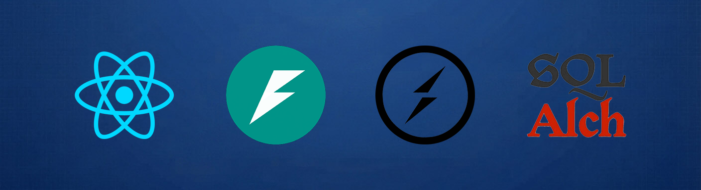

<div align="center">
  
</div>

# Template Web Application

This is a set of templates for creating web applications with:
  * [React](https://react.dev/) (with `TypeScript` and `SCSS`): Library used for building components.
  * [FastAPI](https://fastapi.tiangolo.com/): Framework for building API REST.
  * [Socket.IO](https://socket.io): Event-driven library for real-time communication.
  * [SQLAlchemy](https://www.sqlalchemy.org/): SQL toolkit and Object Relational Mapper.

It uses the [Fast](https://github.com/TheRake66/python-fast) file generator.

## Create an application

Use the following commands to create and initialize a new application:

```sh
fast create project my-app
cd my-app
fast start install
code .
```

## Run application

Use the following commands to run the application:

```sh
fast start frontend
fast start backend
```

## Use WebSocket casting

You have three classes for managing broadcast lists with regular data delivery over WebSockets:
  * `UniCast`: Each user receives unique data.
  * `MultiCast`: A group of users receives shared data.
  * `BroadCast`: All users receive shared data.

`Unicast` is intended for specific use cases. It consumes more resources than `Multicast`, as each user has their own coroutine.

### Example using `UniCast`:

```py
# api/routes/hello.py
from libraries.response import Response
from libraries.unicast import UniCast

async def say_hello(sid: str) -> Response:
  return Response(message=f"Hello user with ID: {sid}!")

# User will receive a message every 3 seconds.
UniCast("hello", say_hello, 3)
```

```tsx
// src/pages/hello.tsx
import { socket } from '../services/backend.ts';

useEffect(() => {
  socket.emit('hello#follow');
  socket.on('hello#receive', data => console.log(data.message));
  return () => {
    socket.emit('hello#follow');
    socket.off('hello#receive');
  };
}, []);
```

### Example using `MultiCast`:

```py
# api/routes/hello.py
from libraries.response import Response
from libraries.multicast import MultiCast

async def say_hello(sids: List[str]) -> Response:
  return Response(message=f"Hello to {len(sids)} users!")

# Users in group will receive a message every 3 seconds.
MultiCast("hello", say_hello, 3)
```

```tsx
// src/pages/hello.tsx
import { socket } from '../services/backend.ts';

useEffect(() => {
  socket.emit('hello#follow');
  socket.on('hello#receive', data => console.log(data.message));
  return () => {
    socket.emit('hello#follow');
    socket.off('hello#receive');
  };
}, []);
```

### Example using `BroadCast`:

```py
# api/routes/hello.py
from libraries.response import Response
from libraries.broadcast import BroadCast

async def say_hello() -> Response:
  return Response(message=f"Hello to all users!")

# All users will receive a message every 3 seconds.
BroadCast("hello", say_hello, 3)
```

```tsx
// src/pages/hello.tsx
import { socket } from '../services/backend.ts';

useEffect(() => {
  socket.on('hello#broadcast', data => console.log(data.message));
  return () => socket.off('hello#broadcast');
}, []);
```

